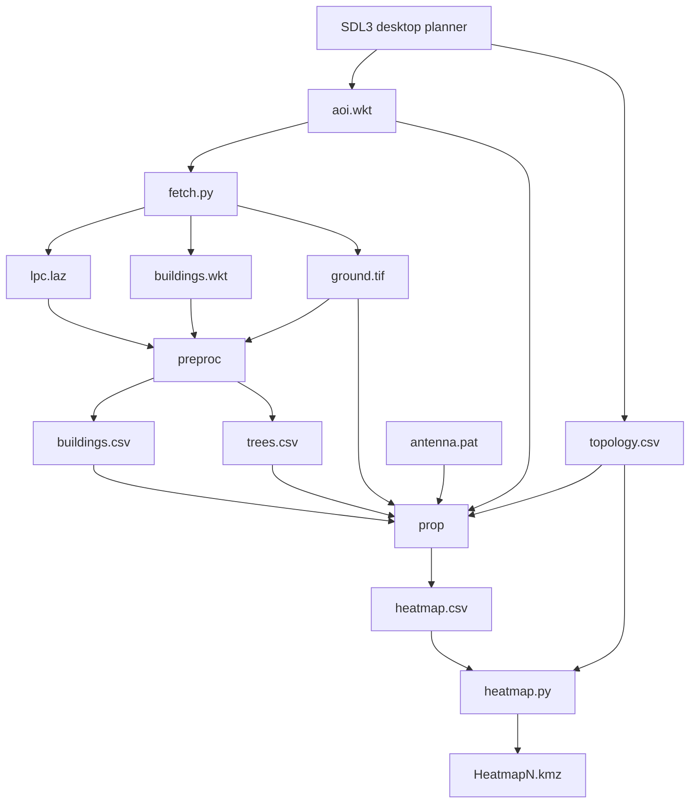

# Pipeline Overview

gprop can be driven from the native desktop planner or stage by stage from the command line.

## Stage summary

| Stage | Component | Current behavior |
|---|---|---|
| Plan | `bin/gprop` | Native SDL3 map, AOI drawing, sector placement, twin selection, simulation launch |
| Acquire | `bin/fetch.py` | OSM footprints plus USGS 3DEP EPT LiDAR; supports full and `--ground-only` modes |
| Preprocess | `bin/preproc` | Uses a GEOS spatial index for footprint assignment, RANSAC roof segmentation, and spatial-grid vegetation clustering |
| Propagate | `bin/prop` | Loads terrain and clutter, supports Polygon/MultiPolygon AOIs, and writes a 5 m best-server RSS grid |
| Visualize | `bin/heatmap.py` | Smooths headerless RSS samples and writes an auto-numbered KMZ; can also render a labeled street-map preview |

## Two supported workflows

### Full digital-twin workflow

Fetch LiDAR and buildings, preprocess roof and tree geometry, and run `prop` with the resulting clutter files. This is the path required when re-enabling diffraction or reflection.

### Preliminary deployment workflow

`run_temporary_coverage.py` runs all directories under `deployments/` using analytic 65° or 33° patterns, empty clutter files, and a flat temporary ground raster. It keeps samples at or above −110 dBm, assigns them to the nearest site, buffers their convex hulls by 25 m, and writes updated deployment AOIs and JSON summaries. `generate_map_previews.py` creates site-level street-map PNGs.

The repository currently contains eight deployment directories: Broome County, Canandaigua, Elmira/Chemung, Elmira Housing Authority, Fruitbelt, Geneva City Hall, Geneva Housing, and Webster.

## Coordinate systems

| Data | CRS |
|---|---|
| AOI and transmitter input | EPSG:4326 |
| LiDAR, footprints, terrain, twin geometry, and heatmap samples | EPSG:3857 |

`prop` reprojects the complete AOI geometry, preserving MultiPolygon parts and interior rings.
